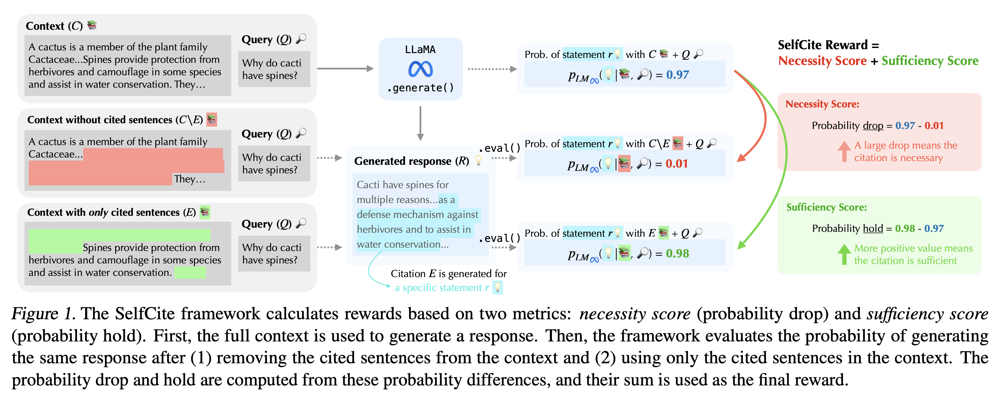

# SelfCite: Self-Supervised Alignment for Context Attribution in Large Language Models

[](https://creativecommons.org/licenses/by-nc/4.0/)
[](https://arxiv.org/abs/2502.09604)
[](https://huggingface.co/voidism/SelfCite-8B)
[](https://voidism.github.io/SelfCite/)
[](https://x.com/YungSungChuang/status/1890431923622682823)
[](https://github.com/facebookresearch/SelfCite/stargazers)

The code for the ICML 2025 paper [SelfCite: Self-Supervised Alignment for Context Attribution in Large Language Models](https://arxiv.org/abs/2502.09604).

Blog Post: https://voidism.github.io/SelfCite/  
Paper: https://arxiv.org/abs/2502.09604  
Authors: [Yung-Sung Chuang](https://people.csail.mit.edu/yungsung/)$^\dagger$, [Benjamin Cohen-Wang](https://bencw99.github.io/)$^\dagger$, [Shannon Zejiang Shen](https://www.szj.io/)$^\dagger$, [Zhaofeng Wu](https://zhaofengwu.github.io/)$^\dagger$, [Hu Xu](https://howardhsu.github.io/)$^\ddagger$, [Xi Victoria Lin](https://victorialin.org/)$^\ddagger$, [James Glass](https://people.csail.mit.edu/jrg/)$^\dagger$, [Shang-Wen Li](https://swdanielli.github.io/)$^\ddagger$, [Wen-tau Yih](https://scottyih.org/)$^\ddagger$  
$^\dagger$ Massachusetts Institute of Technology, $^\ddagger$ Meta AI



## Abstract

We introduce SelfCite, a novel self-supervised approach that aligns LLMs to generate high-quality, fine-grained, sentence-level citations for the statements in their generated responses. 
Instead of only relying on annotated data, SelfCite leverages a reward signal provided by the LLM itself through *context ablation*: If a citation is necessary, removing the cited text from the context should prevent the same response; if sufficient, retaining the cited text alone should preserve the same response. 
This reward can guide the inference-time best-of-N sampling strategy to improve citation quality significantly, as well as be used in preference optimization to directly fine-tune the models for generating better citations. 
The effectiveness of SelfCite is demonstrated by increasing citation F1 up to 5.3 points on the LongBench-Cite benchmark across five long-form question answering tasks.

## Inference

### Requirements

Install the dependencies with conda and pip:
```
conda env create -n myenv python=3.10.14
conda activate myenv
pip install torch==2.4.0
pip install -r inference-requirements.txt
```

or try to create a conda env from `inference-env.yaml`: (notice that sometimes the installation fails due to the support of `torch` and some version conflicts)

```bash
conda env create -f inference-env.yml -n myenv
conda activate myenv
```

### Direct Sampling

#### Baseline: LongCite-8B

```bash
python eval-direct-sampling.py \
    --model_path THUDM/LongCite-llama3.1-8b \
    --tokenizer_path THUDM/LongCite-llama3.1-8b \
    --save_dir $YOUR_OUTPUT_DIR \
    --num_gpus $NUM_GPUS
```

#### Ours: [SelfCite-8B](https://huggingface.co/voidism/SelfCite-8B)

```bash
python eval-direct-sampling.py \
    --model_path voidism/SelfCite-8B \
    --tokenizer_path THUDM/LongCite-llama3.1-8b \
    --save_dir $YOUR_OUTPUT_DIR \
    --num_gpus $NUM_GPUS
```

#### Ours: [SelfCite-8B from ContextCite (CC)](https://huggingface.co/voidism/SelfCite-8B-from-CC) -- a fully self-supervised setting

```bash
python eval-direct-sampling.py \
    --model_path voidism/SelfCite-8B-from-CC \
    --tokenizer_path meta-llama/Llama-3.1-8B-Instruct \
    --save_dir $YOUR_OUTPUT_DIR \
    --num_gpus $NUM_GPUS \
    --llama_chat_template
```


### Best-of-N Sampling

#### Step 1: Sampling candidates

```bash
python eval-best-of-n-sampling.py \
    --model_path THUDM/LongCite-llama3.1-8b \
    --tokenizer_path THUDM/LongCite-llama3.1-8b \
    --save_dir $YOUR_SAMPLING_OUTPUT_DIR \
    --num_gpus $NUM_GPUS
```

If you have multiple nodes, e.g. 4 nodes, you can add the following arguments to split the examples into 4 shards and run them independently: ` --total_shards 4  --shard_id $TASK_ID `

#### Step 2: Reranking candidates

Remember the `--sampling_files` argument should be the same as `$YOUR_SAMPLING_OUTPUT_DIR` of the previous step.

If the sampling was run with multiple shards, the output dir will become `$YOUR_SAMPLING_OUTPUT_DIR/shard_*_out_of_*/`.

```bash
python eval-best-of-n-reranking.py \
    --model_path THUDM/LongCite-llama3.1-8b \
    --tokenizer_path THUDM/LongCite-llama3.1-8b \
    --sampling_files "$YOUR_SAMPLING_OUTPUT_DIR/shard_*_out_of_*/*.json" \
    --save_dir $YOUR_FINAL_OUTPUT_DIR \
    --num_gpus $NUM_GPUS
```

You can still add the following arguments to split the examples into 4 shards and run them independently: ` --total_shards 4 --shard_id $TASK_ID `

##### When sampling with SelfCite-8B-from-CC model

The default chat template is consistent with LongCite-8B, which is different from the original Llama-3.1 chat template.
You need to specify the original Llama-3.1 chat template when using our SelfCite-8B-from-CC model:

```bash
    --llama_chat_template \
    --model_path voidism/SelfCite-8B-from-CC \
    --tokenizer_path meta-llama/Llama-3.1-8B-Instruct \
```

Other Arguments:
- `--rerank_method`: The reranking method for computing reward. The default is `log_prob_drop_and_hold`. Also supports `log_prob_drop`, `log_prob_hold`, `log_prob`.
- `--subset`: The subset of the data to rerank. The default is `all`. Also supports `gov_report`, `dureader`, `multifieldqa_en`, `multifieldqa_zh`, `hotpotqa`, `longbench-chat`.
- `--length_limit`: The maximum length constraint of total cited texts for candidates. The default is 384 tokens. Set to 0 to disable. 

#### Step 3: Combine the shards (optional)

If you have done the inference with multiple shards, you can combine the results of different shards by:

```bash
python merge_shards.py "$YOUR_FINAL_OUTPUT_DIR/log_prob_drop_and_hold/shard_*/tmp/*.jsonl" combined_output.json
```

## Evaluation with GPT-4o

Please clone the repo of [LongCite](https://github.com/THUDM/LongCite.git) by `git clone https://github.com/THUDM/LongCite.git` and run the GPT-4o evaluation using the following two scripts: (you have to change the json file paths and api key in the scripts) 

- Evaluate citation precision/recall/F1: https://github.com/THUDM/LongCite/blob/main/LongBench-Cite/eval_cite.py
- Evaluate answer correctness: https://github.com/THUDM/LongCite/blob/main/LongBench-Cite/eval_correct.py

Alternatively, we also provide two simple end-to-end scripts that can directly execute the code of above two files without manually editing the `.py` files, but please always refer to the original code of LongCite for the most up-to-date version.

```bash
python gpt4o_eval_cite.py --openai_key [your openai api key] --pred_paths [json file names joined by comma]
python gpt4o_eval_correct.py --openai_key [your openai api key] --pred_paths [json file names joined by comma]
```

Here is an example of output scores for the reproduced BoN result with LongCite-8B:

```
# eval_cite.py

{'scores': {'longbench-chat': {'citation_recall': 0.7051421654973379, 'citation_precision': 0.7814080212910136, 'citation_f1': 0.7110260258222623, 'finish': True}, 'multifieldqa_en': {'citation_recall': 0.7660925925925927, 'citation_precision': 0.900499801568687, 'citation_f1': 0.8078295744668001, 'finish': True}, 'multifieldqa_zh': {'citation_recall': 0.775168360685582, 'citation_precision': 0.9532764437360026, 'citation_f1': 0.8341368453045668, 'finish': True}, 'multifieldqa': {'citation_recall': 0.7712787457885866, 'citation_precision': 0.9306578828071531, 'citation_f1': 0.8228623006598098, 'finish': True}, 'hotpotqa': {'citation_recall': 0.701994887057387, 'citation_precision': 0.7575486596736596, 'citation_f1': 0.6958512321505665, 'finish': True}, 'dureader': {'citation_recall': 0.7213021157293504, 'citation_precision': 0.8807152088051942, 'citation_f1': 0.7733387456771217, 'finish': True}, 'gov_report': {'citation_recall': 0.8945381375781791, 'citation_precision': 0.9258361384440542, 'citation_f1': 0.9048006592845036, 'finish': True}}, 'avg_citation_recall': 0.7588512103301681, 'avg_citation_precision': 0.8552331822042148, 'avg_citation_f1': 0.7815757927188528, 'finish': True, 'gpt_usage': {'prompt_tokens': 5398114, 'completion_tokens': 88554, 'gpt_model': 'gpt-4o-2024-05-13'}}

# eval_correct.py

{'scores': {'longbench-chat': {'gpt_score': 0.6639999999999999, 'finish': True}, 'multifieldqa_en': {'gpt_score': 0.81, 'finish': True}, 'multifieldqa_zh': {'gpt_score': 0.84, 'finish': True}, 'multifieldqa': {'gpt_score': 0.8271428571428572, 'finish': True}, 'hotpotqa': {'gpt_score': 0.65, 'finish': True}, 'dureader': {'gpt_score': 0.65, 'finish': True}, 'gov_report': {'gpt_score': 0.5875, 'finish': True}}, 'avg_gpt_score': 0.6757285714285713, 'finish': True, 'gpt_usage': {'prompt_tokens': 679799, 'completion_tokens': 4658, 'gpt_model': 'gpt-4o-2024-05-13'}}
```

The sampling process (for both our model & GPT-4o evaluation) has certain amount of randomness but the averaged scores will be close to the numbers on our paper.

## Training

See the `training` directory for the training code. We follow SimPO's training pipeline with minor modifications.

## Reference Repositories

- LongCite: https://github.com/THUDM/LongCite
- SimPO: https://github.com/princeton-nlp/SimPO

## Citation
Please cite our paper if it's helpful to your work!

[](https://doi.org/10.48550/arXiv.2502.09604)

```bibtex
@inproceedings{chuang2025selfcite,
    title={SelfCite: Self-Supervised Alignment for Context Attribution in Large Language Models},
    author={Yung-Sung Chuang and Benjamin Cohen-Wang and Zejiang Shen and Zhaofeng Wu and Hu Xu and Xi Victoria Lin and James R. Glass and Shang-Wen Li and Wen-tau Yih},
    booktitle={Forty-second International Conference on Machine Learning},
    year={2025},
    url={https://openreview.net/forum?id=rKi8eyJBoB}
}
```

## License
SelfCite is FAIR Noncommercial Research License licensed, as found in the LICENSE file.
